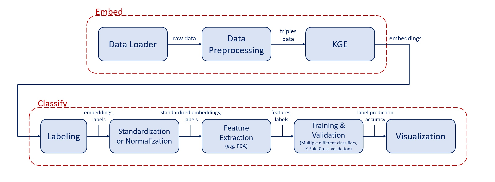

# embedNclassify

"Embed 'N Classify" is an implementation of an Knowledge Graph Embedding (KGE) following up with Classification of the resulting embeddings with different methods. This is an illustration of the pipeline:

